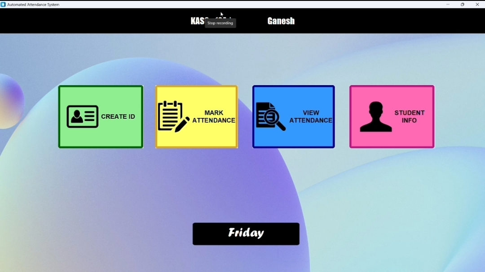
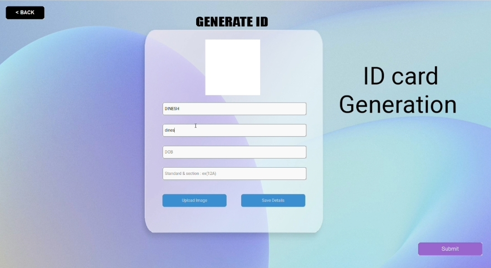
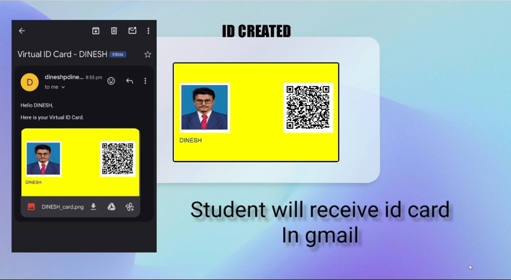
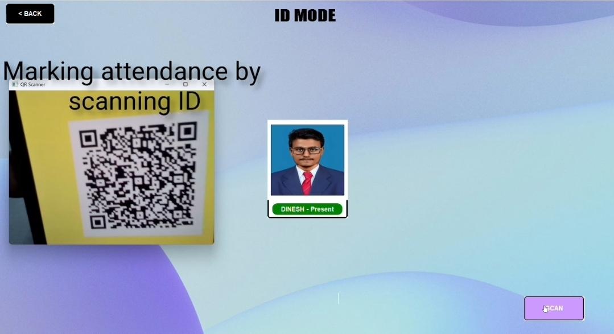
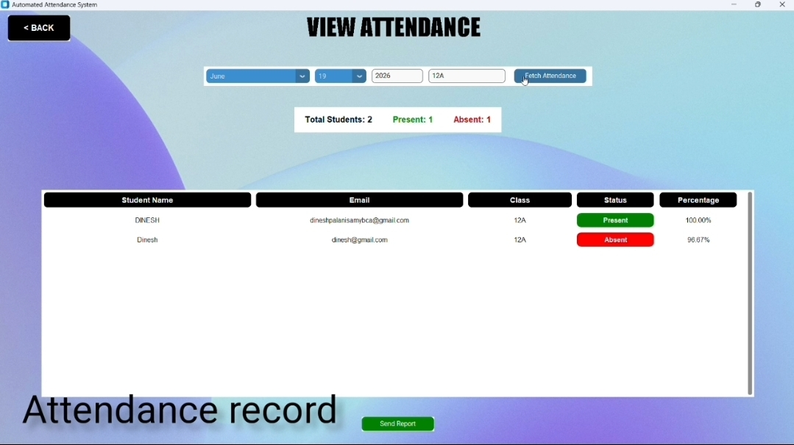

# Automated Attendance System

## 📖 Overview

The Automated Attendance System is a desktop application developed to automate student attendance management and reduce manual work in educational institutions. The system provides an efficient way for teachers to manage student records, generate digital ID cards, track attendance, and communicate attendance information to both teachers and parents through automated email notifications.

The project was developed using Python, CustomTkinter, Tkinter, MySQL, OpenCV, and SMTP Email Integration.

---

## 🏠 Dashboard

The dashboard serves as the central control panel of the application. It provides quick access to all major modules, including student management, ID card generation, attendance tracking, and attendance report generation.

### Features

* User-friendly interface.
* Easy navigation between modules.
* Centralized access to attendance-related operations.

### Screenshot

---

## 🆔 Student Registration & ID Card Generation

Teachers can register students by entering their personal and academic information. Once the registration process is completed, the system automatically generates a digital student ID card.

### Features

* Register student details.
* Store student information securely in MySQL.
* Generate digital student ID cards automatically.
* Associate student information with a unique ID.

### Information Stored

* Student Name
* Class
* Email Address
* Parent Information

### Screenshot

---

## 📨 Digital ID Card Delivery

After generating the student ID card, the system automatically sends the digital ID card to the student's registered Gmail account.

This eliminates the need for manual distribution and ensures that every student receives their ID card instantly.

### Features

* Automatic email delivery.
* Digital ID card sharing.
* Fast and secure communication.

### Screenshot

---

## 📷 Student Information Verification

Students can scan their digital ID cards using a webcam. The system uses OpenCV to identify the student and retrieve their information from the database.

### Features

* Webcam-based scanning.
* Fast student identification.
* Instant information retrieval.

### Information Displayed

* Student Name
* Class
* Email Address

### Screenshot

---

## ✅ Automated Attendance Tracking

The attendance process is completely automated. When a student scans their ID card successfully, the system automatically marks the student as Present.

Students who do not scan their ID cards are automatically considered Absent.

### Features

* Automatic attendance marking.
* No manual attendance entry required.
* Accurate attendance records.
* Reduced administrative workload.

### Screenshot

---

## 📧 Email Notification System

The system automatically communicates attendance information through email.

### Features

* Attendance reports sent to teachers.
* Parents notified when a student is absent.
* Automated email communication.
* Improved parent-teacher interaction.

### Notifications

#### Teacher Notification

Teachers receive attendance reports containing:

* Present Students
* Absent Students
* Attendance Summary

#### Parent Notification

Parents receive an email notification if their child is marked absent on a particular day.

---

## 📊 Attendance Reports

Teachers can generate attendance reports by selecting a class and a specific date. The system displays attendance statistics and allows reports to be shared directly through email.

### Features

* View attendance records by class.
* View attendance records by date.
* Display present and absent students.
* Calculate attendance percentage.
* Send reports through email.

### Screenshot

---

## ⚙️ Technologies Used

| Technology    | Purpose                      |
| ------------- | ---------------------------- |
| Python        | Core Application Development |
| CustomTkinter | Modern User Interface        |
| Tkinter       | GUI Components               |
| MySQL         | Database Management          |
| OpenCV        | Student ID Card Scanning     |
| SMTP          | Email Notifications          |

---

## 🔄 System Workflow

1. Teacher registers student information.
2. The system generates a digital student ID card.
3. The ID card is automatically sent to the student's Gmail account.
4. Students scan their ID cards using a webcam.
5. Student information is verified automatically.
6. Attendance is marked as Present.
7. Students who do not scan are marked Absent.
8. Attendance reports are generated.
9. Attendance reports are sent to teachers.
10. Parents receive absence notifications when necessary.

---

## 🚀 Future Enhancements

* Face Recognition Based Attendance
* QR Code Attendance System
* Cloud Database Integration
* Mobile Application Support
* Real-Time Analytics Dashboard
* Multi-School Management Support

---

## 👨‍💻 Author

**Dinesh**

Computer Science Student | Python Developer | Software Development Enthusiast

GitHub: https://github.com/ceoa491-dev
